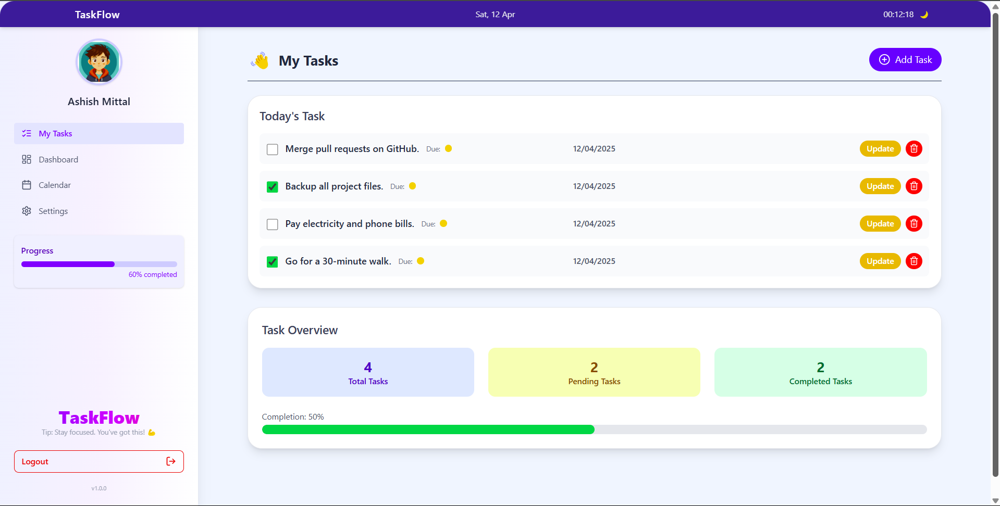

##  Preview

  

---

#  TaskFlow

**TaskFlow** is a sleek and efficient To-Do application that helps you manage your daily tasks, boost productivity, and stay organized. With a minimalist design and essential features, TaskFlow ensures your day runs smoothly — one task at a time.

---

## 🔥 Features

- 📝 Add, edit, and delete tasks easily
- ✅ Mark tasks as completed
- 🔐 User authentication (Login / Signup)
- 🧠 Secure JWT-based session management
- 👤 Logged-in users see only their own tasks
- 📅 Due date & priority support (optional)
- 🔍 Filter tasks (All / Completed / Pending)
- 📱 Fully responsive design
---

## ⚙️ Tech Stack

| Frontend         | Backend              | Database             |
|------------------|----------------------|----------------------|
| React + Vite     | Node.js + Express    | MongoDB Atlas             |
| Tailwind CSS     | JWT Auth             | Mongoose             |

---

## 🌐 Live Demo

👉 [Click here to try TaskFlow](https://task-flow-task-manager-mwbp.vercel.app/)

---
